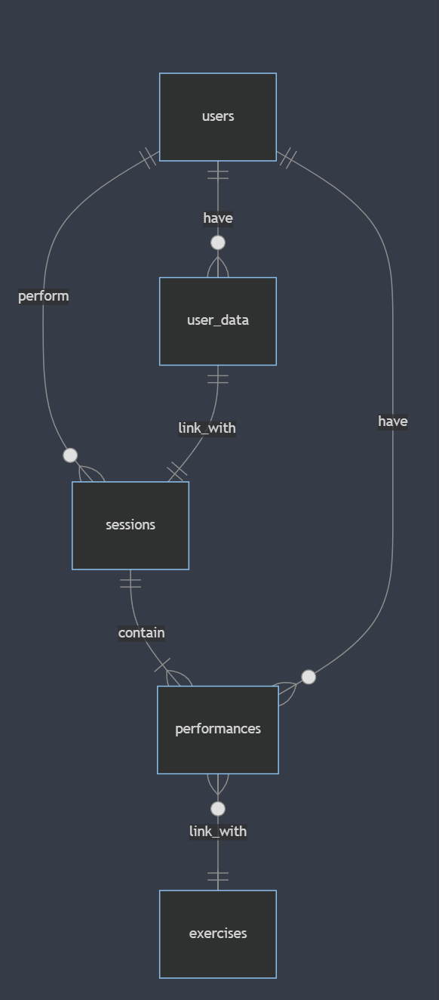

# Design Document

By Kacper Kubiak

Video overview: <https://youtu.be/Z3PAF7SE_Xo>

## Scope

The purpose of this database, is for it to function as a workout log of exercise sessions for multiple people.

The database contains a list of:
* Users, including basic identifying information
* User weight and readiness tied to a specific date
* Exercises, including their names and equipment neccesary to perform them
* Performances in said exercises, tied to specific exercise sessions
* Exercise sessions, including the aforementioned performances, as well as a date and exertion metric

The database does not track dietary intake, nor serve as a personal coach/workout planner.

## Functional Requirements

Users should be able to:
* Input and track their own weight
* Input, track and observe data relating to their own exercise performances, choices and sessions.
* Upon inputting a set into the performances table, a trigger will be used to automatically track the number of the exercise set of the workout.
* Upon a user inputting a session, a trigger will automatically link it to their latest user_data entry, and retroactively link the user_data entry to the session (foreign keys).

## Representation

Entities are captured in SQLite tables with the following schema:

### Entities

The database contains the following entities:

    users, user_data, exercises, sessions, performance

As for attributes;

#### users

The `users` table contains:
* `id`, which specifies the unique ID for the user as an `INTEGER`. This column thus has the `PRIMARY KEY` constraint applied.
* `first_name`, which specifies the user's first name as a `TEXT` type, given `TEXT` is appropriate for name fields.
* `last_name`, which specifies the user's last name as a `TEXT` type for the same reason as above.

Both the first and last name are required for identification purposes, and thus have the `NOT NULL` constraint applied.

#### user_data

The `user_data` table contains:
* `id`, which specifies the unique ID for the data entry as an `INTEGER`. This column thus has the `PRIMARY KEY` constraint applied.
* `user_id`, which specifies the user's ID from the `users` table the data entry is tied to, as an `INTEGER`. This column has the `FOREIGN KEY` constraint applied, referencing the `id` column of the `users` table to ensure data integrity.
* `session_id`, which specifies the ID of the workout session from the `sessions` table the data entry is tied to, as an `INTEGER`. This column has the `FOREIGN KEY` constraint applied, referencing the `id` column of the `sessions` table to ensure data integrity.
* `user_weight_kg`, which specifies the user's weight as a `NUMERIC` type affinity with a non-negative constraint applied, able to store both integers and floats, which correlates with real world weight logging.
* `perceived_readiness`, which specifies a user's readiness before the workout session as an `INTEGER`. This column is constrained to a value between 1 and 10 inclusive. Such typing and constraint reflects the real world RPE scale.
* `date_of_input`, which stores the date on which the data was submitted. This value is stored in a declared `TIMESTAMP` type, showing intent for the type of data meant to be stored here. The appropriate usage here is `yyyy-mm-dd`, as declared in a schema comment.
This column has a `NOT NULL` constraint applied, and the default value here is the current timestamp.

#### exercises

The `exercises` table contains:
* `id`, which specifies the unique ID for the exercise entry as an `INTEGER`. This column has the `PRIMARY KEY` constraint applied thusly.
* `exercise_name`, which specifies the name of the exercise entered into the database as a `TEXT` type. This typing is appropriate for exercise names. This column further has a `NOT NULL` constraint applied, as it is required.
* `equipment_needed`, which specifies the equipment needed to perform the above mentioned exercises. This column exists for ease of searching doable exercises with limited equipment available or preffered equipment, before making a decision on what exercises to pick in another table. The typing of the column is `TEXT`, appropriatly to the entered data.

#### sessions
The `sessions` table contains:
* `id`, which specifies the unique ID for the workout session column as an `INTEGER`. This column has the `PRIMARY KEY` constraint applied.
* `user_id`, which is the id of the user performing the sessions, as an `INTEGER`. This column thus has the `FOREIGN KEY` constraint applied, referencing the `id` of the `users` table, to ensure data integrity.
* `user_data_id`, which like the above, references the `id` inside the `user_data` table as an `INTEGER` for the user data logged before performing the workout session. Naturally, it has the `FOREIGN KEY` constraint applied.
* `sRPE`, which specifies the percieved session exertion rate on a subjective 1 to 10 scale, as an `INTEGER`, appropriately for this kind of scale. A not null constraint is applied to enforce tracking of this variable.
* `date_of_input`, which stores the date on which the workout session was completed. This value is stored in a declared `TIMESTAMP` type, showing intent for the type of data meant to be stored here. The appropriate usage here is `yyyy-mm-dd`, as declared in a schema comment. This column has a `NOT NULL` constraint applied, and the default value here is the current timestamp.

#### performances
The `performances` table contains:
* `id`, which specifies the unique ID for the performance entry regarding a specific exercise, as an `INTEGER`. This column has the `PRIMARY KEY` constraint applied.
* `session_id`, as an `INTEGER`, which links the performance to a specific workout session. This column has the `FOREIGN KEY` constraint applied, referencing the `id` of the `sessions` column to ensure data integrity.
* `user_id`, as an `INTEGER`, wchich links the performance to a specific user. This column has the `FOREIGN KEY` constraint applied, referencing the `id` of the `users` column.
* `exercise_id`, as an `INTEGER`, which links the performance to a specific exercise that it is an expression of. This column has the `FOREIGN KEY` constraint applied, referencing the `id` of the `exercises` column. This coulmn has a `NOT NULL` constraint added, in order to not allow users to add a performance of an exercise, that is not in the exercise bank.
* `date_of_input`, which stores the date on which the performance was completed. This value is stored in a declared `TIMESTAMP` type, showing intent for the type of data meant to be stored here. The appropriate usage here is `yyyy-mm-dd`, as declared in a schema comment. This column has a `NOT NULL` constraint applied, and the default value here is the current timestamp.
* `weight`, which signifies the weight moved during an exercise performance, as a `NUMERIC` type affinity, being able to store both floats and integers, aprropriate for a weight expression.
* `reps`, which signifies the amount of repetitions completed of the given movement, stored as an `INTEGER` - only full repetitions are counted by design.
* `RPE`, which specifies the percieved exertion rate of the movement, on a subjective 1 to 10 scale, as an `INTEGER`, appropriately for this kind of scale.
* `set_no`, which specifies the no. of the set of a given exercise on a given session. The default value set for this column is 1.

All of the columns have a `NOT NULL` constraint applied to them, as they are neccesary for the proper functioning of the log.

### Relationships

The ER diagram below represents the relationships between the entities within this database:

As per above:

* One user can have zero (if they have not yet started any workout) to many user data entries, as these pertain to their specific stats right before a workout session, and are tied to those thereby. Naturally, a user_data entry is tied to only one user, as it describes their state.
* One user can have zero to many performances of an exercise, with similar reasoning as above - performances are part of a workout session that a user can not have yet started. At the same time, a performance is only ever tied to one user, as they are an expression of that user's performance. No joint-efforts here!
* One user can perform zero to many workout sessions, as alluded prior. A workout session is only ever tied to one user. Also no cooperation ;)
* One user_data entry is linked with exactly one workout session, as these as alluded to prior, contain data of the user right before they preform their workout session. Likewise a session is only ever tied to one user_data entry, as only the direct state of one user right before the session is important here.
* One workout session contains one, or more performances, as a workout session without any exercise performances is not a useful concept. A session can consist of however one exercise performance (one set), or many of those (multiple sets), with either one exercise itself or a variety of them. An exercise performancec is directly linked to only one workout session however, as a workout performance naturally can't stretch over multiple workout sessions in time. No time travelling!
* One exercise performance is linked to only one exercise, as it is an expression thereof. However an exercise can be linked to zero (has not been performed yet and is in the database for future users), or many performances, as multiple users can perform the exercise multiple times.

## Optimizations

The indexes I created, basing on the queries in `querires.sql` are as follows:

It is common for queries to search for a particular user's data, using a `where` clause on `users` `first_name` and `last_name` to obtain their `id` to reference their assigned data.
Thereby, `users` `first_name` and `last_name` is the first, and upmost index.

Furthermore, users are prone to search for exercises using equipment needed, or the reverse. thereby `exercise_name` and `equipment_needed` are indexed.
Users will commonly also want to view their workout sessions, along with the user_data entries linked with them, thereby `sessions` `user_id` and `user_data_id` is indexed.
A user will often also want to view ther own performances of a particular exercise, therefore `performances` `user_id` and `exercise_id` are indexed. They might also want to limit that to a specific workout session, so `session_id` is also indexed.

A view I created is `view_user_sessions` which is meant to simplyfy viewing all sessions, joined with exercises and exercise data. A user's sessions can be further individualized by quering with their `user_id` in a `WHERE` clause, a particular session can be individualized too with the `session_id` and it can also be further limited to a particular exercise with `exercise_name`, as seen and commented int queries.sql.

## Limitations

The current database does not allow per-user controls/access, thereby, everyone has access to everyone elses' data and can freely add, edit or delete entries.
Solving this would require moving to a different database management system, or hadling the database with an outside application/splitting the database up to recreate a single one per user.

